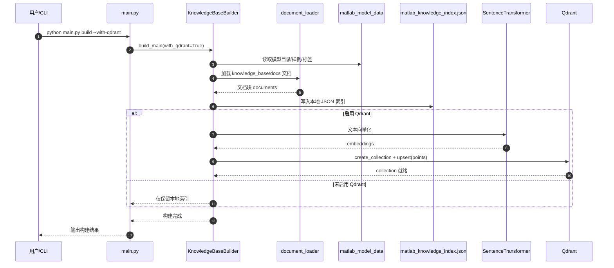
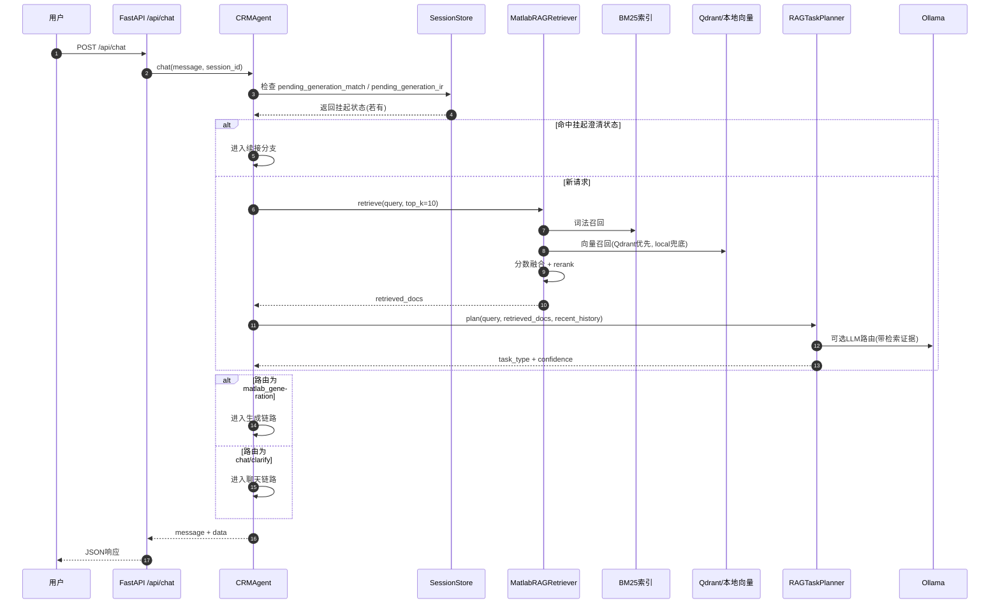
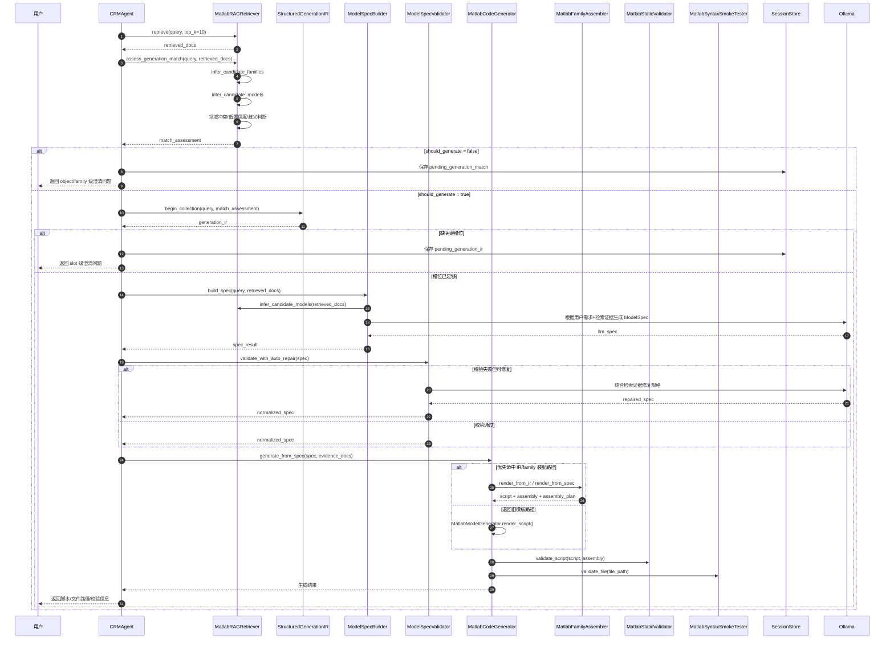
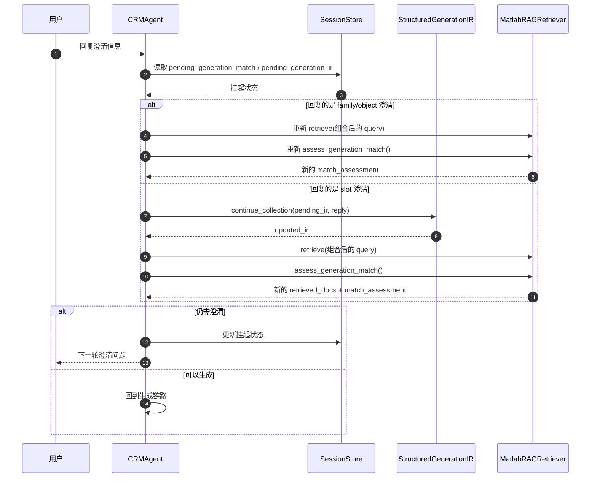
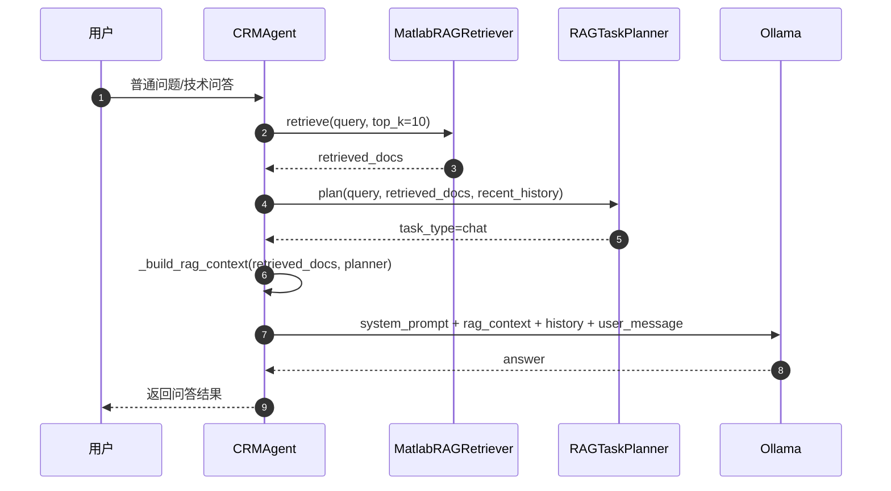
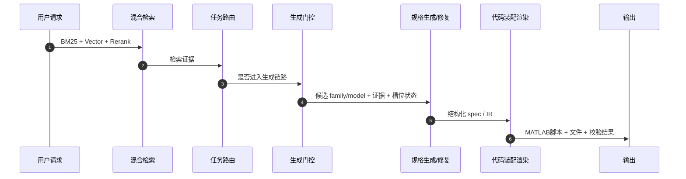

# 当前项目 RAG 调用链时序图

本文档按“索引构建 -> 在线请求总链路 -> 生成分支 -> 聊天分支”的顺序，描述当前仓库里 RAG 是如何参与任务路由、生成门控、结构化规格生成和最终 MATLAB 脚本生成的。

---

## 1. 先说结论

当前项目里的 RAG 不是只在“普通问答时检索几段文本”这么简单。

它至少参与了四层：

- 检索层：`BM25 + 向量召回(Qdrant/local) + 规则重排`
- 路由层：检索结果会影响 `chat / matlab_generation / clarify` 判定
- 门控层：生成前先基于检索结果判断是否应该直接生成，还是先澄清
- 规格层：`ModelSpec` 的构建和修复会显式使用检索证据

而真正的 MATLAB 代码渲染阶段，更多是“基于前面 RAG 决定出来的 family / spec / IR 做确定性装配”。

---

## 2. 索引构建链路

这个链路对应 `python main.py build` 或 `python main.py build --with-qdrant`。

### 这个阶段的 RAG 作用

- 先把模型目录、知识文档、领域标签和样例语料整理成可检索知识源
- 再把知识源写成本地 JSON 索引
- 可选地建立 Qdrant 向量索引，供运行期做混合检索

---

## 3. 在线请求总链路

这是最核心的一张图，展示当前 RAG 如何进入主请求流程。

### 这里体现的 RAG 增强

- 不是先让 LLM 裸跑，而是先检索再路由
- 路由器不是只看用户原句，还看 `retrieved_docs`
- 即便是聊天问答，也会先走一次检索

---

## 4. 生成分支时序图

这是当前项目里 RAG 参与最深的一条链路。

### 这一段里，RAG 具体增强了什么

#### 4.1 生成前门控

RAG 不是“检索完直接生成”，而是先做一层生成门控：

- 是否有候选 family / model
- 是否存在明显领域冲突
- top family 是否足够稳定
- 是否需要先做 object 级或 family 级澄清

这一步的产物就是 `match_assessment`。

#### 4.2 规格生成

`ModelSpecBuilder` 会把这些内容送进 LLM：

- 用户需求
- 候选模型列表
- 检索证据摘要
- JSON Schema 约束

所以这里不是“纯提示词自由生成”，而是一个典型的检索增强结构化生成过程。

#### 4.3 规格修复

当规格校验失败时，修复链路也会继续引用检索证据，而不是盲修。

#### 4.4 代码生成

代码生成本身主要是：

- `OpenModelIR / ModelSpec`
- `AssemblyPlan`
- family assembler / template fallback
- 静态校验 / smoke 校验

也就是说，RAG 更多决定“生成什么”和“按什么 family/spec 生成”，后面的 `.m` 渲染则更接近确定性装配。

---

## 5. 挂起澄清续接链路

当前项目的一个特点是：澄清不是中断式的，而是可续接的。

### 这里的意义

- 澄清回答不是只做字符串拼接
- 系统会把澄清结果重新喂回检索器
- 所以每轮澄清后，候选 family / model 和门控判断都会重新计算

---

## 6. 普通聊天/问答分支

当前项目里，普通聊天同样带有 RAG 上下文，只是没有进入 MATLAB 生成链路。

### 这里的意义

- 聊天回答时会显式拼装“检索证据上下文”
- 这让回答优先基于本仓库知识，而不是只依赖通用模型记忆

---

## 7. `/api/health` 如何判断 RAG 是否真在工作

当前项目不是“只要能回复就算 RAG 正常”。

健康检查会返回 `retrieval.hybrid_effective`，用于判断当前是否处于真正的混合检索状态：

- `true`：通常表示 BM25 + 向量检索都可用
- `false`：通常表示已经退化成非完整混合检索，例如向量侧不可用

因此，`/api/health` 不只是检查服务活着没活着，也在检查 RAG 是否处于完整工作状态。

---

## 8. 一张图总结“RAG 增强体现在哪”

一句话概括：

> 当前项目的 RAG 不是只增强“回答内容”，而是增强了“路由、门控、规格生成与修复”这整条生成前链路。

---

## 9. 对应代码入口速查

- 索引构建：`knowledge_base/builder.py`
- 检索器：`knowledge_base/rag_retriever.py`
- 任务路由：`agents/task_planner.py`
- 主编排：`agents/crm_agent.py`
- 结构化槽位收集：`agents/structured_generation_ir.py`
- 规格生成与修复：`agents/model_spec_builder.py`
- 规格校验：`agents/model_spec_validator.py`
- 代码生成：`agents/matlab_codegen.py`
- API 健康检查：`api/server.py`

---

## 10. 最后一句话

如果把当前项目拆成“生成前”和“生成后”两段：

- 生成前半段：明显是 RAG 深度参与的智能决策链
- 生成后半段：更偏向基于 family / spec / IR 的确定性装配与验证链
